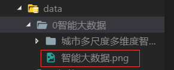
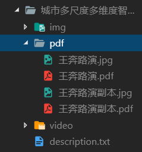

# 项目展览馆毕设

## 客户端 (./client)

- ### 启动客户端

```javascript
cd client
npm install
npm start
```

## 服务端 (./server)


- ### 启动服务

```javascript
cd server
npm install
node app.js
```

## 文件系统以及存放规则 (./server/data/)

- ### 项目源文件存放位置

  > 所有项目存放在与服务主文件 app.js 相同的 data 文件夹中 (./server/data/)

- ### 文件项目存放规则介绍(data 文件夹中存放的项目)

1. #### 项目大分类

   

   > - **6 个文件夹对应六个分类**
   >   > - 文件夹前的序号不做修改
   >   > - 文件夹序号后面的名字即分类
   >   > - 此处增加文件夹以及相对应增加文件夹前数字即增加分类

2. #### 项目大分类的 icon

   

   > - **分类文件夹下 png 文件即为 navbar 中该分类的 icon**
   >   > - icon 名称和分类的名字相同
   >   > - 该图片的格式使用.png

3. #### 项目文件夹结构

   

   > - **分类问价夹下的每个文件夹即为该分类下的每个项目**
   >   > - 文件夹名字为该项目的名称
   >   > - 项目文件夹下 img 文件夹存放项目图片
   >   > - 项目文件夹下 pdf 文件夹存放项目 pdf 演示文档(ppt 转换成 pdf)
   >   > - 项目文件夹下 video 文件夹存放项目视频
   >   > - 项目文件夹下的 description.txt 中存放该项目的简介介绍(以 UTF-8 编码储存)

4. #### 项目文件夹下 img 文件夹

   

   > - **存放展示图片和对应缩略图以及该项目封面图片**
   >   > - 所有图片以.jpg 格式
   >   > - 展示图片和缩略图(放于 thumbs 中)名称一致
   >   > - 图片名称可以以实际意义命名,鼠标放在该图片上会有相应提示文字
   >   > - 封面图片的名字固定为 cover

5. #### 项目文件夹下 video 文件夹

   

   > - **存放视频文件以及对应封面缩略图**
   >   > - 视频文件名字与缩略图名字相同
   >   > - 视频格式需要 chrome 支持
   >   > - 图片格式用.jpg

6. #### 项目文件夹下 pdf 文件夹
   
   > - **存放 pdf 文件和其对应封面缩略**
   >   > - pdf 文件名字与缩略图名字相同
   >   > - 图片格式用.jpg
